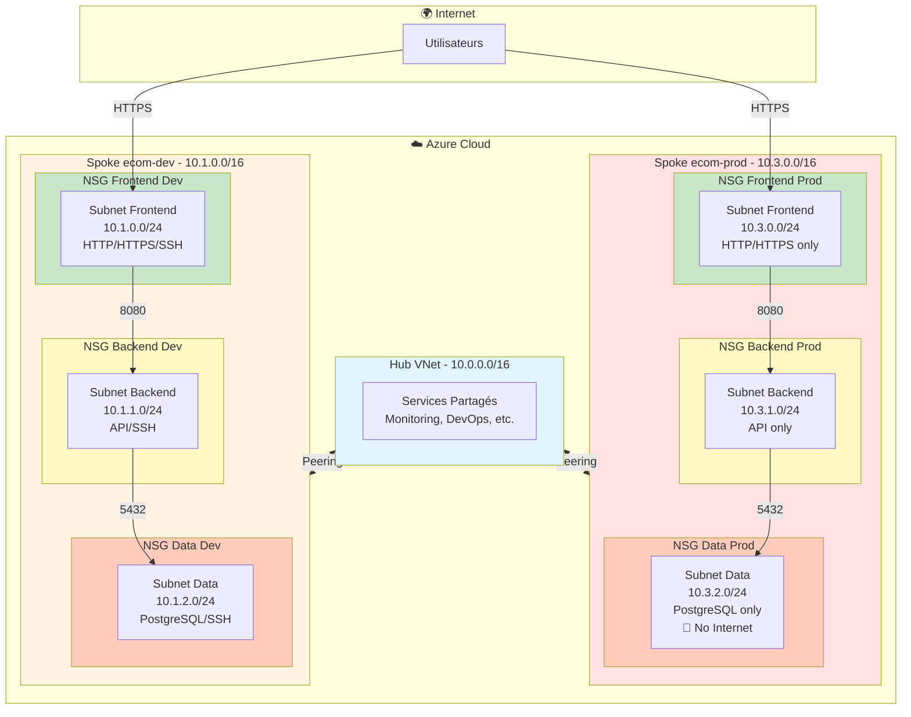
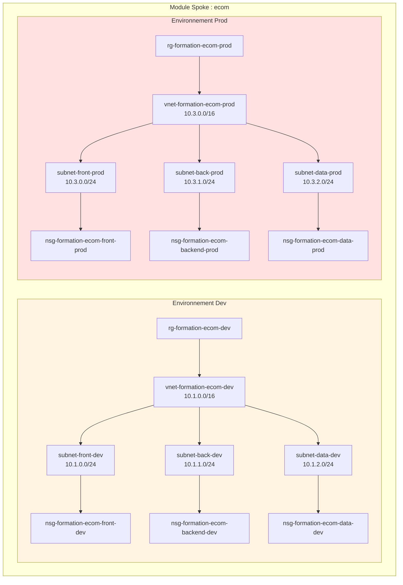
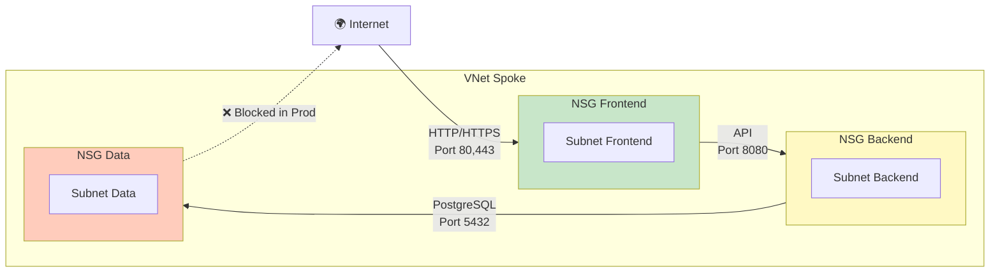
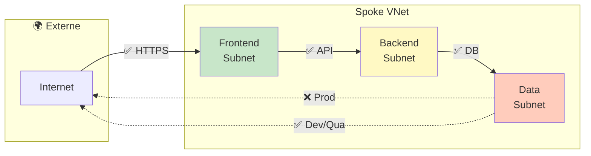
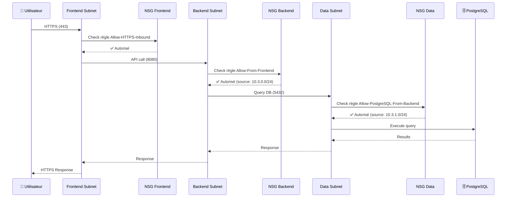
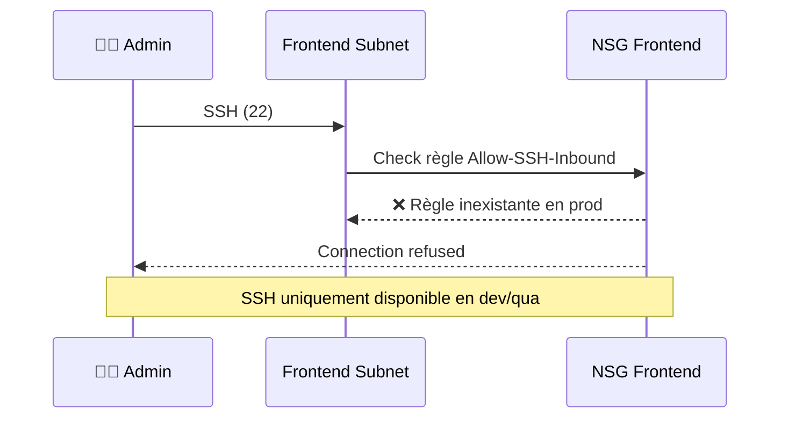
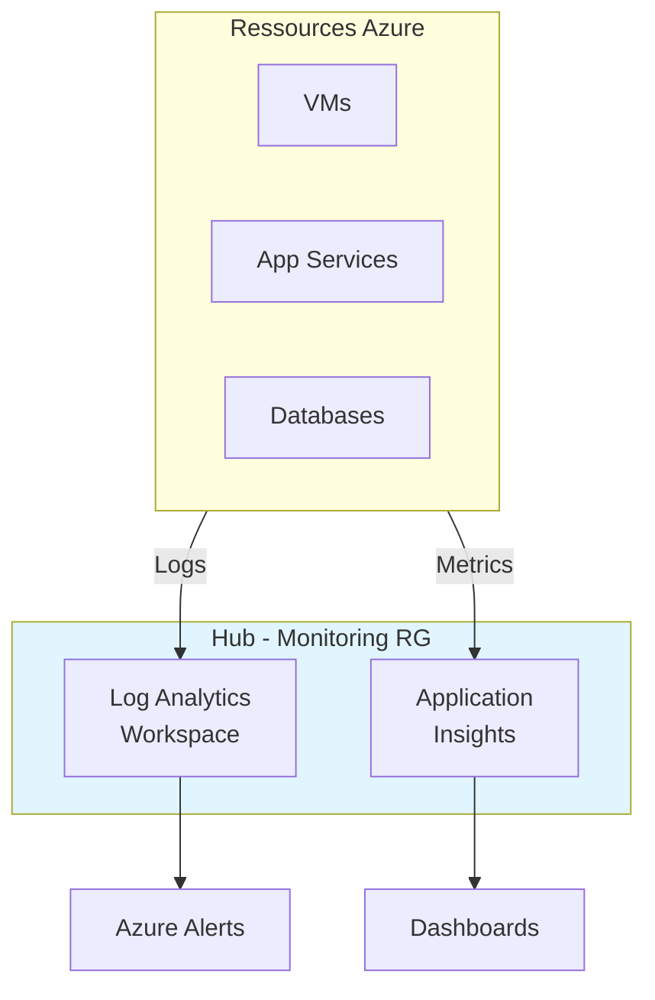

# 🏗️ Architecture Technique - Landing Zone Azure

Ce document détaille l'architecture technique de la Landing Zone Hub & Spoke déployée avec Terraform.

## 📋 Table des Matières

- [Vue d'ensemble](#vue-densemble)
- [Architecture Réseau](#architecture-réseau)
- [Composants Détaillés](#composants-détaillés)
- [Flux Réseau](#flux-réseau)
- [Sécurité](#sécurité)
- [Plan d'Adressage IP](#plan-dadressage-ip)
- [Ressources Créées](#ressources-créées)

---

## 🎯 Vue d'ensemble

### Principe Hub & Spoke

```mermaid
graph TB
    subgraph Hub["🏢 HUB - Services Partagés"]
        HubVNet[VNet Hub<br/>10.0.0.0/16]
        Monitoring[Monitoring<br/>RG]
        Network[Network<br/>RG]
        Security[Security<br/>RG]
        DevOps[DevOps<br/>RG]
    end

    subgraph Spoke1["📦 SPOKE - Projet ecom"]
        Spoke1Dev[Dev<br/>10.1.0.0/16]
        Spoke1Qua[Qua<br/>10.2.0.0/16]
        Spoke1Prod[Prod<br/>10.3.0.0/16]
    end

    subgraph Spoke2["📦 SPOKE - Autres Projets"]
        Spoke2[...]
    end

    HubVNet <-->|VNet Peering| Spoke1Dev
    HubVNet <-->|VNet Peering| Spoke1Qua
    HubVNet <-->|VNet Peering| Spoke1Prod
    HubVNet <-->|VNet Peering| Spoke2

    style Hub fill:#e1f5ff
    style Spoke1 fill:#fff4e1
    style Spoke2 fill:#fff4e1
```

### Avantages de l'Architecture

✅ **Isolation** : Chaque projet/environnement a son propre réseau
✅ **Services partagés** : Le Hub centralise les services communs
✅ **Sécurité** : NSG par subnet avec règles granulaires
✅ **Scalabilité** : Ajout facile de nouveaux spokes
✅ **Coûts optimisés** : Pas de NAT Gateway, Firewall uniquement si nécessaire

---

## 🌐 Architecture Réseau

### Diagramme Réseau Complet



---

## 🧩 Composants Détaillés

### 1. Hub - Services Partagés

#### Resource Groups

| Nom | Fonction | Contenu typique |
|-----|----------|-----------------|
| `rg-formation-monitoring` | Monitoring | Log Analytics, Application Insights |
| `rg-formation-network` | Réseau | VNet Hub, Firewall, VPN Gateway |
| `rg-formation-security` | Sécurité | Key Vault, Sentinel |
| `rg-formation-devops` | DevOps | Container Registry, Artifact Store |

#### VNet Hub

```
VNet: vnet-formation-hub
CIDR: 10.0.0.0/16
Région: francecentral
```

**Utilisation future** :
- Subnet pour Azure Firewall
- Subnet pour VPN Gateway
- Subnet pour Azure Bastion
- Subnet pour services partagés

---

### 2. Spoke - Par Projet

Chaque spoke représente un **projet** avec ses **environnements**.

#### Structure d'un Spoke



#### Subnets par Environnement

Chaque environnement a **3 subnets** :

| Tier | Subnet | CIDR | Usage |
|------|--------|------|-------|
| **Frontend** | `subnet-front-{env}` | `10.x.0.0/24` | Web servers, Load balancers, App Services |
| **Backend** | `subnet-back-{env}` | `10.x.1.0/24` | API servers, Microservices, Functions |
| **Data** | `subnet-data-{env}` | `10.x.2.0/24` | Databases, Storage, Cache |

**Calcul automatique** avec Terraform `cidrsubnet()` :
```hcl
front = cidrsubnet("10.1.0.0/16", 8, 0)  # → 10.1.0.0/24
back  = cidrsubnet("10.1.0.0/16", 8, 1)  # → 10.1.1.0/24
data  = cidrsubnet("10.1.0.0/16", 8, 2)  # → 10.1.2.0/24
```

---

## 🔒 Sécurité

### Network Security Groups (NSG)

#### Architecture des NSG



#### Règles NSG - Frontend

| Règle | Direction | Priorité | Port | Source | Destination | Dev/Qua | Prod |
|-------|-----------|----------|------|--------|-------------|---------|------|
| Allow-HTTP-Inbound | Inbound | 100 | 80 | * | * | ✅ | ✅ |
| Allow-HTTPS-Inbound | Inbound | 110 | 443 | * | * | ✅ | ✅ |
| Allow-SSH-Inbound | Inbound | 120 | 22 | * | * | ✅ | ❌ |

#### Règles NSG - Backend

| Règle | Direction | Priorité | Port | Source | Destination | Dev/Qua | Prod |
|-------|-----------|----------|------|--------|-------------|---------|------|
| Allow-From-Frontend | Inbound | 100 | 8080 | Frontend subnet | * | ✅ | ✅ |
| Allow-SSH-Inbound | Inbound | 120 | 22 | * | * | ✅ | ❌ |

#### Règles NSG - Data

| Règle | Direction | Priorité | Port | Source | Destination | Dev/Qua | Prod |
|-------|-----------|----------|------|--------|-------------|---------|------|
| Allow-PostgreSQL-From-Backend | Inbound | 100 | 5432 | Backend subnet | * | ✅ | ✅ |
| Allow-SSH-Inbound | Inbound | 120 | 22 | * | * | ✅ | ❌ |
| Deny-Internet-Outbound | Outbound | 4000 | * | * | Internet | ❌ | ✅ |

### Matrice de Flux



---

## 🗺️ Plan d'Adressage IP

### Vue d'ensemble

```
Azure Landing Zone
│
├── Hub : 10.0.0.0/16 (65,536 IPs)
│   └── Réservé pour services partagés
│
└── Spokes
    ├── Dev : 10.1.0.0/16 (65,536 IPs)
    │   ├── Frontend : 10.1.0.0/24 (256 IPs)
    │   ├── Backend : 10.1.1.0/24 (256 IPs)
    │   └── Data : 10.1.2.0/24 (256 IPs)
    │
    ├── Qua : 10.2.0.0/16 (65,536 IPs)
    │   ├── Frontend : 10.2.0.0/24 (256 IPs)
    │   ├── Backend : 10.2.1.0/24 (256 IPs)
    │   └── Data : 10.2.2.0/24 (256 IPs)
    │
    └── Prod : 10.3.0.0/16 (65,536 IPs)
        ├── Frontend : 10.3.0.0/24 (256 IPs)
        ├── Backend : 10.3.1.0/24 (256 IPs)
        └── Data : 10.3.2.0/24 (256 IPs)
```

### Détail par Environnement

| Environnement | VNet CIDR | Frontend | Backend | Data |
|---------------|-----------|----------|---------|------|
| **Hub** | 10.0.0.0/16 | - | - | - |
| **Dev** | 10.1.0.0/16 | 10.1.0.0/24 | 10.1.1.0/24 | 10.1.2.0/24 |
| **Qua** | 10.2.0.0/16 | 10.2.0.0/24 | 10.2.1.0/24 | 10.2.2.0/24 |
| **Prod** | 10.3.0.0/16 | 10.3.0.0/24 | 10.3.1.0/24 | 10.3.2.0/24 |

### Extensibilité

**Adresses réservées pour futurs projets :**
```
10.4.0.0/16 → Projet 2
10.5.0.0/16 → Projet 3
...
10.255.0.0/16 → Projet N
```

---

## 📦 Ressources Créées

### Pour le Hub

```
1 VNet Hub
4 Resource Groups
```

### Pour chaque Spoke (exemple : ecom)

Par **environnement** (dev, qua, prod) :

```
1 Resource Group
1 VNet
3 Subnets
3 NSG
9 Règles NSG (environ)
2 VNet Peerings (Hub ↔ Spoke)
```

**Total pour 1 spoke avec 3 environnements :**
```
3 Resource Groups
3 VNets
9 Subnets
9 NSG
~27 Règles NSG
6 VNet Peerings
```

### Total Infrastructure Complète

Pour **1 Hub + 1 Spoke (ecom)** :

| Ressource | Quantité |
|-----------|----------|
| Resource Groups | 7 (4 Hub + 3 Spoke) |
| VNets | 4 (1 Hub + 3 Spoke) |
| Subnets | 9 (0 Hub + 9 Spoke) |
| NSG | 9 (0 Hub + 9 Spoke) |
| Règles NSG | ~27 |
| VNet Peerings | 6 (2 par environnement) |

---

## 🔄 Flux de Données

### Exemple : Requête utilisateur en Production



### Tentative SSH en Production (Bloquée)



---

## 🚀 Évolutivité

### Ajouter un Nouvel Environnement

Modifier `variables.tf` :
```hcl
variable "environments" {
  default = ["dev", "qua", "preprod", "prod"]  # Ajout de preprod
}

variable "spoke_address_spaces" {
  default = {
    dev     = "10.1.0.0/16"
    qua     = "10.2.0.0/16"
    preprod = "10.4.0.0/16"  # Nouveau
    prod    = "10.3.0.0/16"
  }
}
```

### Ajouter un Nouveau Projet

Dans `main.tf` :
```hcl
module "analytics" {
  source = "./modules/spoke"

  project_name = "analytics"
  # ... autres paramètres
}
```

Toutes les ressources seront créées automatiquement !

---

## 🔍 Monitoring et Observabilité

### Logs et Métriques (à implémenter)



**Recommandations :**
- ✅ Activer les diagnostic settings sur tous les NSG
- ✅ Centraliser les logs dans Log Analytics (Hub)
- ✅ Créer des alertes pour les tentatives de connexion suspectes
- ✅ Monitorer les flux réseau avec Network Watcher

---

## 📊 Comparaison avec d'Autres Architectures

### Hub & Spoke vs VNet Isolés

| Critère | Hub & Spoke | VNets Isolés |
|---------|-------------|--------------|
| **Services partagés** | ✅ Centralisés | ❌ Dupliqués |
| **Coûts** | 💰 Optimisés | 💰💰 Élevés |
| **Complexité** | 🔧 Moyenne | 🔧🔧 Faible |
| **Gouvernance** | ✅ Facilitée | ⚠️ Difficile |
| **Scalabilité** | ✅ Excellente | ⚠️ Limitée |

### Hub & Spoke vs Azure Virtual WAN

| Critère | Hub & Spoke (manuel) | Virtual WAN |
|---------|----------------------|-------------|
| **Coûts** | 💰 Faibles | 💰💰💰 Élevés |
| **Gestion** | 🔧 Manuelle | ✅ Automatisée |
| **Flexibilité** | ✅ Totale | ⚠️ Limitée |
| **Use case** | PME, Projets | Grandes entreprises |

---

## 🎓 Ressources et Références

### Documentation Microsoft

- [Hub-spoke network topology](https://learn.microsoft.com/azure/architecture/reference-architectures/hybrid-networking/hub-spoke)
- [Virtual Network Documentation](https://learn.microsoft.com/azure/virtual-network/)
- [Network Security Groups](https://learn.microsoft.com/azure/virtual-network/network-security-groups-overview)
- [VNet Peering](https://learn.microsoft.com/azure/virtual-network/virtual-network-peering-overview)

### Best Practices

- [Azure Cloud Adoption Framework](https://learn.microsoft.com/azure/cloud-adoption-framework/)
- [Azure Landing Zones](https://learn.microsoft.com/azure/cloud-adoption-framework/ready/landing-zone/)
- [Azure Naming Convention](https://learn.microsoft.com/azure/cloud-adoption-framework/ready/azure-best-practices/resource-naming)

---

**📖 Retour au [README principal](./README.md)**
